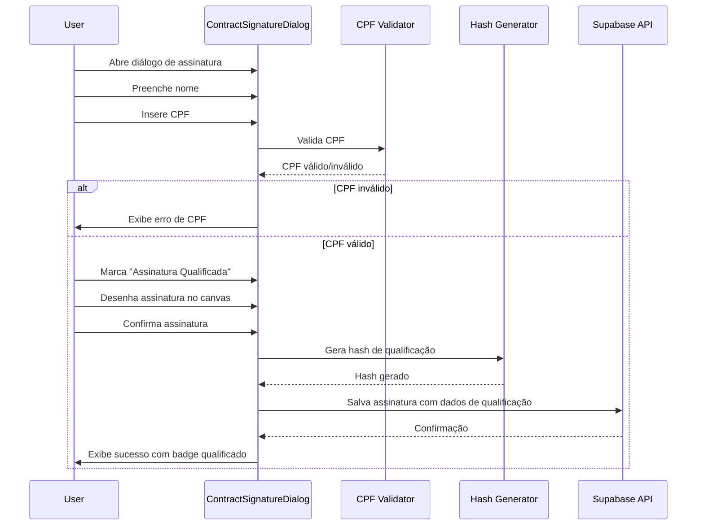

# Assinatura Digital Qualificada Simplificada com Validação CPF

## Objetivo

Adicionar funcionalidade de assinatura digital qualificada simplificada no módulo de contratos, usando validação de CPF como método de identificação do signatário, mantendo a coleta de assinatura via canvas existente.

## Requisitos

### O que será implementado:

1. **Campo CPF obrigatório** na assinatura
2. **Validação de CPF** (formato e dígitos verificadores)
3. **Armazenamento de informações de identidade** baseadas em CPF
4. **Coleta de assinatura via canvas** (mantém sistema atual)
5. **Campos de auditoria e validação** necessários para qualificação
6. **Indicador visual** de assinatura qualificada

### O que NÃO será usado:

- Certificado digital físico (A1/A3)
- Validação por SMS
- Validação por email
- Serviços terceirizados
- Biometria
- Integrações externas

## Arquitetura da Solução

### 1. Extensão do Schema de Banco de Dados

**Migration:** `supabase/migrations/[timestamp]_add_qualified_signature_cpf.sql`

Adicionar campos na tabela `contract_signatures` existente:

```sql
-- Adicionar campos para assinatura qualificada simplificada
ALTER TABLE public.contract_signatures
  ADD COLUMN IF NOT EXISTS is_qualified BOOLEAN DEFAULT false,
  ADD COLUMN IF NOT EXISTS signer_cpf TEXT,
  ADD COLUMN IF NOT EXISTS cpf_validated BOOLEAN DEFAULT false,
  ADD COLUMN IF NOT EXISTS identity_verification_method TEXT DEFAULT 'cpf',
  ADD COLUMN IF NOT EXISTS qualification_timestamp TIMESTAMPTZ,
  ADD COLUMN IF NOT EXISTS qualification_hash TEXT, -- Hash do documento + CPF + assinatura
  ADD COLUMN IF NOT EXISTS qualification_details JSONB DEFAULT '{}'::jsonb;

-- Índice para busca por CPF
CREATE INDEX IF NOT EXISTS idx_contract_signatures_cpf 
  ON public.contract_signatures(signer_cpf) 
  WHERE signer_cpf IS NOT NULL;

-- Índice para assinaturas qualificadas
CREATE INDEX IF NOT EXISTS idx_contract_signatures_qualified 
  ON public.contract_signatures(is_qualified) 
  WHERE is_qualified = true;

-- Constraint para garantir que assinaturas qualificadas tenham CPF
ALTER TABLE public.contract_signatures
  ADD CONSTRAINT check_qualified_has_cpf 
  CHECK (
    (is_qualified = false) OR 
    (is_qualified = true AND signer_cpf IS NOT NULL AND cpf_validated = true)
  );

-- Comentários
COMMENT ON COLUMN public.contract_signatures.is_qualified IS 'Indica se é assinatura qualificada simplificada';
COMMENT ON COLUMN public.contract_signatures.signer_cpf IS 'CPF do signatário (validado)';
COMMENT ON COLUMN public.contract_signatures.cpf_validated IS 'Indica se CPF foi validado (formato e dígitos)';
COMMENT ON COLUMN public.contract_signatures.identity_verification_method IS 'Método de verificação de identidade (cpf)';
COMMENT ON COLUMN public.contract_signatures.qualification_timestamp IS 'Timestamp da qualificação da assinatura';
COMMENT ON COLUMN public.contract_signatures.qualification_hash IS 'Hash SHA-256 do documento + CPF + assinatura para integridade';
COMMENT ON COLUMN public.contract_signatures.qualification_details IS 'Detalhes adicionais da qualificação (JSONB)';
```

### 2. Utilitário de Validação de CPF

**Arquivo:** `src/lib/cpfValidator.ts`

```typescript
/**
 * Valida formato e dígitos verificadores do CPF
 */
export function validateCPF(cpf: string): {
  isValid: boolean;
  formatted: string;
  error?: string;
} {
  // Remove caracteres não numéricos
  const cleanCPF = cpf.replace(/\D/g, '');
  
  // Verifica se tem 11 dígitos
  if (cleanCPF.length !== 11) {
    return {
      isValid: false,
      formatted: cleanCPF,
      error: 'CPF deve conter 11 dígitos'
    };
  }
  
  // Verifica se todos os dígitos são iguais (CPF inválido)
  if (/^(\d)\1{10}$/.test(cleanCPF)) {
    return {
      isValid: false,
      formatted: cleanCPF,
      error: 'CPF inválido'
    };
  }
  
  // Valida primeiro dígito verificador
  let sum = 0;
  for (let i = 0; i < 9; i++) {
    sum += parseInt(cleanCPF.charAt(i)) * (10 - i);
  }
  let digit = 11 - (sum % 11);
  if (digit >= 10) digit = 0;
  if (digit !== parseInt(cleanCPF.charAt(9))) {
    return {
      isValid: false,
      formatted: cleanCPF,
      error: 'CPF inválido - primeiro dígito verificador incorreto'
    };
  }
  
  // Valida segundo dígito verificador
  sum = 0;
  for (let i = 0; i < 10; i++) {
    sum += parseInt(cleanCPF.charAt(i)) * (11 - i);
  }
  digit = 11 - (sum % 11);
  if (digit >= 10) digit = 0;
  if (digit !== parseInt(cleanCPF.charAt(10))) {
    return {
      isValid: false,
      formatted: cleanCPF,
      error: 'CPF inválido - segundo dígito verificador incorreto'
    };
  }
  
  // Formata CPF (XXX.XXX.XXX-XX)
  const formatted = `${cleanCPF.slice(0, 3)}.${cleanCPF.slice(3, 6)}.${cleanCPF.slice(6, 9)}-${cleanCPF.slice(9, 11)}`;
  
  return {
    isValid: true,
    formatted
  };
}

/**
 * Formata CPF para exibição
 */
export function formatCPF(cpf: string): string {
  const clean = cpf.replace(/\D/g, '');
  if (clean.length !== 11) return cpf;
  return `${clean.slice(0, 3)}.${clean.slice(3, 6)}.${clean.slice(6, 9)}-${clean.slice(9, 11)}`;
}
```

### 3. Utilitário de Hash de Qualificação

**Arquivo:** `src/lib/qualificationHash.ts`

```typescript
/**
 * Gera hash de qualificação para garantir integridade
 * Hash = SHA-256(contract_id + signer_cpf + signature_data + signed_at)
 */
export async function generateQualificationHash(
  contractId: string,
  cpf: string,
  signatureData: string,
  signedAt: string
): Promise<string> {
  const data = `${contractId}-${cpf}-${signatureData}-${signedAt}`;
  const encoder = new TextEncoder();
  const hashBuffer = await crypto.subtle.digest('SHA-256', encoder.encode(data));
  const hashArray = Array.from(new Uint8Array(hashBuffer));
  return hashArray.map(b => b.toString(16).padStart(2, '0')).join('');
}
```

### 4. Atualização dos Tipos TypeScript

**Arquivo:** `src/types/contract.ts`

Adicionar campos na interface `ContractSignature`:

```typescript
export interface ContractSignature {
  id: string;
  contract_id: string;
  signer_type: SignerType;
  signer_name: string;
  signature_data: string; // base64 PNG
  signed_at: string;
  ip_address?: string;
  user_agent?: string;
  device_info?: Record<string, any>;
  geolocation?: Record<string, any>;
  validation_hash?: string;
  signed_ip_country?: string;
  created_at: string;
  
  // Novos campos para assinatura qualificada
  is_qualified?: boolean;
  signer_cpf?: string;
  cpf_validated?: boolean;
  identity_verification_method?: 'cpf';
  qualification_timestamp?: string;
  qualification_hash?: string;
  qualification_details?: Record<string, any>;
}
```

### 5. Atualização do Componente de Assinatura

**Arquivo:** `src/components/contracts/ContractSignatureDialog.tsx`

Adicionar:

1. Campo de CPF com máscara e validação
2. Checkbox "Assinatura Qualificada" (opcional ou obrigatório conforme configuração)
3. Validação de CPF antes de permitir assinatura
4. Geração de hash de qualificação
5. Salvamento dos campos adicionais

Modificações principais:

```typescript
// Adicionar estados
const [signerCPF, setSignerCPF] = useState('');
const [cpfError, setCpfError] = useState<string | null>(null);
const [isQualified, setIsQualified] = useState(false);

// Validação de CPF em tempo real
const handleCPFChange = (value: string) => {
  setSignerCPF(value);
  if (value.replace(/\D/g, '').length === 11) {
    const validation = validateCPF(value);
    if (!validation.isValid) {
      setCpfError(validation.error || 'CPF inválido');
    } else {
      setCpfError(null);
      setSignerCPF(validation.formatted);
    }
  } else {
    setCpfError(null);
  }
};

// No handleSubmit, adicionar lógica de qualificação
if (isQualified) {
  // Validar CPF obrigatório
  const cpfValidation = validateCPF(signerCPF);
  if (!cpfValidation.isValid) {
    toast({
      title: 'CPF inválido',
      description: cpfValidation.error || 'Por favor, insira um CPF válido',
      variant: 'destructive',
    });
    return;
  }
  
  // Gerar hash de qualificação
  const qualificationHash = await generateQualificationHash(
    contract.id,
    cpfValidation.formatted.replace(/\D/g, ''),
    signatureData,
    new Date().toISOString()
  );
  
  // Incluir campos de qualificação no payload
  signaturePayload.is_qualified = true;
  signaturePayload.signer_cpf = cpfValidation.formatted.replace(/\D/g, '');
  signaturePayload.cpf_validated = true;
  signaturePayload.identity_verification_method = 'cpf';
  signaturePayload.qualification_timestamp = new Date().toISOString();
  signaturePayload.qualification_hash = qualificationHash;
  signaturePayload.qualification_details = {
    validation_method: 'cpf',
    validated_at: new Date().toISOString(),
    cpf_formatted: cpfValidation.formatted
  };
}
```

### 6. Componente de Input de CPF

**Arquivo:** `src/components/ui/cpf-input.tsx`

Criar componente reutilizável com máscara:

```typescript
import { Input } from '@/components/ui/input';
import { validateCPF, formatCPF } from '@/lib/cpfValidator';

export function CPFInput({ value, onChange, error, ...props }) {
  const handleChange = (e: React.ChangeEvent<HTMLInputElement>) => {
    const rawValue = e.target.value.replace(/\D/g, '');
    if (rawValue.length <= 11) {
      const formatted = formatCPF(rawValue);
      onChange(formatted);
    }
  };
  
  return (
    <div>
      <Input
        value={value}
        onChange={handleChange}
        placeholder="000.000.000-00"
        maxLength={14}
        {...props}
      />
      {error && <p className="text-sm text-red-600 mt-1">{error}</p>}
    </div>
  );
}
```

### 7. Atualização do Hook de Assinaturas

**Arquivo:** `src/hooks/useContractSignatures.ts`

Atualizar função `addSignature` para aceitar campos de qualificação:

```typescript
const addSignature = async (
  contractId: string,
  signerType: 'user' | 'client',
  signerName: string,
  signatureData: string,
  options?: {
    isQualified?: boolean;
    signerCPF?: string;
    qualificationHash?: string;
  }
) => {
  // ... código existente ...
  
  const payload: any = {
    contract_id: contractId,
    signer_type: signerType,
    signer_name: signerName,
    signature_data: signatureData,
    signed_at: new Date().toISOString(),
  };
  
  if (options?.isQualified) {
    payload.is_qualified = true;
    payload.signer_cpf = options.signerCPF;
    payload.cpf_validated = true;
    payload.identity_verification_method = 'cpf';
    payload.qualification_timestamp = new Date().toISOString();
    payload.qualification_hash = options.qualificationHash;
    payload.qualification_details = {
      validation_method: 'cpf',
      validated_at: new Date().toISOString()
    };
  }
  
  // ... resto do código ...
};
```

### 8. Componente de Badge de Assinatura Qualificada

**Arquivo:** `src/components/contracts/QualifiedSignatureBadge.tsx`

```typescript
import { Badge } from '@/components/ui/badge';
import { Shield, CheckCircle2 } from 'lucide-react';

export function QualifiedSignatureBadge() {
  return (
    <Badge variant="default" className="bg-green-600 hover:bg-green-700">
      <Shield className="w-3 h-3 mr-1" />
      <CheckCircle2 className="w-3 h-3 mr-1" />
      Assinatura Qualificada
    </Badge>
  );
}
```

### 9. Atualização da Visualização de Assinaturas

**Arquivo:** `src/components/contracts/ContractViewer.tsx` ou componente similar

Adicionar:

- Badge "Assinatura Qualificada" quando `is_qualified = true`
- Exibição de CPF (mascarado parcialmente: XXX.XXX.XXX-XX)
- Informações de validação
- Hash de qualificação para verificação

### 10. Atualização do PDF Generator

**Arquivo:** `src/lib/contractPdfGenerator.ts`

Adicionar seção especial para assinaturas qualificadas no PDF:

```typescript
// Na função generateContractPDF, ao adicionar assinaturas:
if (signature.isQualified) {
  // Adicionar badge "Assinatura Qualificada"
  doc.setFillColor(34, 197, 94); // Verde
  doc.rect(margin, yPosition, 60, 8, 'F');
  doc.setTextColor(255, 255, 255);
  doc.setFontSize(8);
  doc.text('ASSINATURA QUALIFICADA', margin + 2, yPosition + 5);
  
  // Adicionar CPF (parcialmente mascarado)
  doc.setTextColor(0, 0, 0);
  doc.setFontSize(9);
  doc.text(`CPF: ${maskCPF(signature.signerCPF)}`, margin, yPosition + 15);
  
  // Adicionar hash de qualificação
  doc.setFontSize(7);
  doc.text(`Hash: ${signature.qualificationHash?.substring(0, 16)}...`, margin, yPosition + 22);
}
```

### 11. Configuração de Organização (Opcional)

**Arquivo:** Migration adicional para permitir configurar se assinatura qualificada é obrigatória

```sql
-- Adicionar configuração de assinatura qualificada obrigatória
ALTER TABLE public.contracts
  ADD COLUMN IF NOT EXISTS require_qualified_signature BOOLEAN DEFAULT false;

-- Ou na tabela de templates
ALTER TABLE public.contract_templates
  ADD COLUMN IF NOT EXISTS require_qualified_signature BOOLEAN DEFAULT false;
```

## Fluxo de Assinatura Qualificada



## Estrutura de Dados da Assinatura Qualificada

```typescript
{
  id: "uuid",
  contract_id: "uuid",
  signer_type: "user" | "client",
  signer_name: "Nome Completo",
  signature_data: "base64...",
  signed_at: "2026-01-03T...",
  
  // Campos de qualificação
  is_qualified: true,
  signer_cpf: "12345678901", // Sem formatação no banco
  cpf_validated: true,
  identity_verification_method: "cpf",
  qualification_timestamp: "2026-01-03T...",
  qualification_hash: "sha256_hash...",
  qualification_details: {
    validation_method: "cpf",
    validated_at: "2026-01-03T...",
    cpf_formatted: "123.456.789-01"
  },
  
  // Campos de auditoria existentes
  ip_address: "...",
  user_agent: "...",
  device_info: {...},
  validation_hash: "..."
}
```

## Validações Implementadas

1. **Validação de CPF**: Formato e dígitos verificadores
2. **Integridade**: Hash SHA-256 do documento + CPF + assinatura
3. **Timestamp**: Data/hora da qualificação
4. **Auditoria**: IP, user agent, device info (já existente)

## Indicadores Visuais

1. **Badge "Assinatura Qualificada"** na lista de contratos
2. **Ícone de escudo** nas assinaturas qualificadas
3. **CPF mascarado** na visualização (XXX.XXX.XXX-XX)
4. **Hash de qualificação** visível para verificação
5. **Destaque visual** no PDF gerado

## Testes Necessários

1. Validação de CPF válido
2. Validação de CPF inválido (dígitos errados)
3. Validação de CPF inválido (formato errado)
4. Geração de hash de qualificação
5. Salvamento de assinatura qualificada
6. Exibição de badge e informações
7. Geração de PDF com assinatura qualificada
8. Máscara de CPF no input