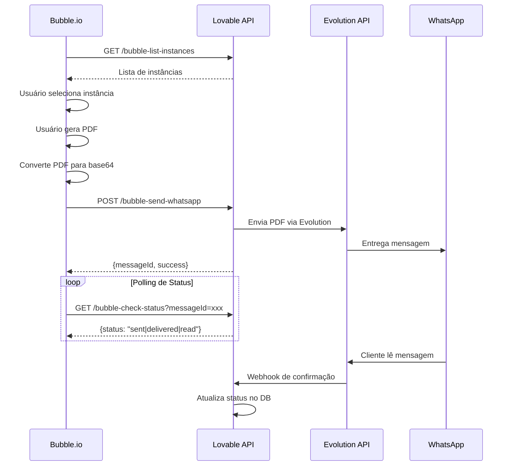

# 📘 Guia de Integração Bubble.io → WhatsApp

Documentação completa para integração do Bubble.io com sistema de envio de WhatsApp via Evolution API.

---

## 🔐 Autenticação

Todos os endpoints requerem autenticação via API Key no header:

```http
X-API-Key: [SUA_CHAVE_AQUI]
```

⚠️ **IMPORTANTE:** Solicite a chave `BUBBLE_API_KEY` ao administrador do sistema.

---

## 📤 1. Enviar PDF via WhatsApp

**Endpoint:** `POST https://orcbxgajfhgmjobsjlix.supabase.co/functions/v1/bubble-send-whatsapp`

### Request

**Headers:**
```http
Content-Type: application/json
X-API-Key: [SUA_CHAVE]
```

**Body Schema:**
```json
{
  "phone": "5511999999999",              // OBRIGATÓRIO: Número com DDI (apenas dígitos)
  "instanceId": "uuid-da-instancia",     // OBRIGATÓRIO: UUID da instância Evolution
  "message": "Segue seu orçamento",      // OPCIONAL: Mensagem de texto antes do PDF
  "pdfFile": {                           // OBRIGATÓRIO
    "filename": "orcamento-123.pdf",     // OBRIGATÓRIO: Nome do arquivo
    "data": "base64_encoded_pdf_here"    // OBRIGATÓRIO: PDF em base64
  },
  "metadata": {                          // OPCIONAL: Dados extras para tracking
    "budgetId": "123",
    "clientName": "João Silva",
    "customField": "qualquer valor"
  }
}
```

### Response - Sucesso (200)

```json
{
  "success": true,
  "messageId": "3EB0123ABC456DEF789",
  "timestamp": "2025-11-13T10:30:00.000Z",
  "phone": "5511999999999"
}
```

### Response - Erros

**401 - API Key Inválida:**
```json
{
  "error": "Unauthorized - Invalid API Key"
}
```

**400 - Campos Obrigatórios Ausentes:**
```json
{
  "error": "Missing required fields",
  "required": ["phone", "instanceId", "pdfFile.filename", "pdfFile.data"]
}
```

**404 - Instância Não Encontrada:**
```json
{
  "error": "Evolution instance not found"
}
```

**500 - Erro ao Enviar:**
```json
{
  "error": "Failed to send WhatsApp message",
  "details": "detalhes do erro"
}
```

### Exemplo cURL

```bash
curl -X POST \
  https://orcbxgajfhgmjobsjlix.supabase.co/functions/v1/bubble-send-whatsapp \
  -H "Content-Type: application/json" \
  -H "X-API-Key: SUA_CHAVE_AQUI" \
  -d '{
    "phone": "5511999999999",
    "instanceId": "a1bd330f-f2cb-4f5d-8fc6-cd11e065a4f8",
    "message": "Olá! Segue seu orçamento em anexo.",
    "pdfFile": {
      "filename": "orcamento-2024-001.pdf",
      "data": "JVBERi0xLjQKJeLjz9MK..."
    },
    "metadata": {
      "budgetId": "2024-001",
      "clientName": "Maria Santos",
      "value": 1500.00
    }
  }'
```

### Como Converter PDF para Base64 no Bubble.io

No Bubble.io, use a expressão:

```
[File Upload's value]:formatted as base64
```

Ou através de um plugin de conversão de arquivos.

---

## 📋 2. Listar Instâncias Disponíveis

**Endpoint:** `GET https://orcbxgajfhgmjobsjlix.supabase.co/functions/v1/bubble-list-instances`

### Request

**Headers:**
```http
X-API-Key: [SUA_CHAVE]
```

**Sem body ou query params**

### Response - Sucesso (200)

```json
{
  "instances": [
    {
      "id": "a1bd330f-f2cb-4f5d-8fc6-cd11e065a4f8",
      "name": "Ana Oficial",
      "isConnected": true,
      "phoneNumber": "5511987654321",
      "organizationId": "org-uuid-123"
    },
    {
      "id": "b2ce441g-g3dc-5g6e-9gd7-de22f176b5g9",
      "name": "Suporte",
      "isConnected": true,
      "phoneNumber": "5511912345678",
      "organizationId": "org-uuid-123"
    }
  ],
  "count": 2
}
```

### Exemplo cURL

```bash
curl -X GET \
  https://orcbxgajfhgmjobsjlix.supabase.co/functions/v1/bubble-list-instances \
  -H "X-API-Key: SUA_CHAVE_AQUI"
```

### Como Usar no Bubble.io

1. Faça uma requisição GET quando a página carregar
2. Armazene o array `instances` em um Custom State
3. Use um Dropdown com data source = Custom State's instances
4. Option caption = `name`
5. Option value = `id`

---

## 🔍 3. Verificar Status de Leitura

**Endpoint:** `GET https://orcbxgajfhgmjobsjlix.supabase.co/functions/v1/bubble-check-status?messageId={messageId}`

### Request

**Headers:**
```http
X-API-Key: [SUA_CHAVE]
```

**Query Parameters:**
- `messageId` (obrigatório): O ID retornado ao enviar a mensagem

### Response - Sucesso (200)

```json
{
  "messageId": "3EB0123ABC456DEF789",
  "phone": "5511999999999",
  "status": "read",
  "sentAt": "2025-11-13T10:30:00.000Z",
  "deliveredAt": "2025-11-13T10:30:05.000Z",
  "readAt": "2025-11-13T10:31:20.000Z",
  "metadata": {
    "budgetId": "123",
    "clientName": "João Silva"
  }
}
```

### Possíveis Status

- `sent` - Mensagem enviada
- `delivered` - Mensagem entregue
- `read` - Mensagem lida

### Response - Erros

**400 - MessageId Ausente:**
```json
{
  "error": "Missing messageId parameter"
}
```

**404 - Mensagem Não Encontrada:**
```json
{
  "error": "Message not found"
}
```

### Exemplo cURL

```bash
curl -X GET \
  "https://orcbxgajfhgmjobsjlix.supabase.co/functions/v1/bubble-check-status?messageId=3EB0123ABC456DEF789" \
  -H "X-API-Key: SUA_CHAVE_AQUI"
```

### Polling no Bubble.io

Para monitorar o status em tempo real:

1. Após enviar mensagem, salve o `messageId` em um Custom State
2. Configure um Workflow recorrente (a cada 5-10 segundos)
3. Faça GET para `bubble-check-status` com o messageId
4. Quando `status` = "read", pare o polling
5. Atualize a UI com o status

---

## 🚀 Fluxo Completo de Integração

### Cenário: Enviar Orçamento do Bubble



---

## 📝 Implementação Passo-a-Passo no Bubble.io

### 1. Configuração Inicial

**Criar um API Connector:**
- Name: `Lovable WhatsApp API`
- Authentication: `None` (usaremos header customizado)

### 2. Configurar Endpoint: Enviar PDF

**Settings:**
- Name: `send_whatsapp_pdf`
- Use as: `Action`
- Data type: `JSON`
- Method: `POST`
- URL: `https://orcbxgajfhgmjobsjlix.supabase.co/functions/v1/bubble-send-whatsapp`

**Headers:**
```
X-API-Key: [PRIVATE_KEY]
Content-Type: application/json
```

**Body:**
```json
{
  "phone": "<phone>",
  "instanceId": "<instanceId>",
  "message": "<message>",
  "pdfFile": {
    "filename": "<filename>",
    "data": "<pdfBase64>"
  },
  "metadata": {
    "budgetId": "<budgetId>"
  }
}
```

**Initialize call:**
- phone: `5511999999999`
- instanceId: `a1bd330f-f2cb-4f5d-8fc6-cd11e065a4f8`
- message: `Teste`
- filename: `test.pdf`
- pdfBase64: `JVBERi0xLjQ=`
- budgetId: `123`

### 3. Configurar Endpoint: Listar Instâncias

**Settings:**
- Name: `list_instances`
- Use as: `Data`
- Data type: `JSON`
- Method: `GET`
- URL: `https://orcbxgajfhgmjobsjlix.supabase.co/functions/v1/bubble-list-instances`

**Headers:**
```
X-API-Key: [PRIVATE_KEY]
```

### 4. Configurar Endpoint: Verificar Status

**Settings:**
- Name: `check_status`
- Use as: `Data`
- Data type: `JSON`
- Method: `GET`
- URL: `https://orcbxgajfhgmjobsjlix.supabase.co/functions/v1/bubble-check-status?messageId=<messageId>`

**Headers:**
```
X-API-Key: [PRIVATE_KEY]
```

### 5. Workflow de Envio

**When Button "Enviar Orçamento" is clicked:**

```
Step 1: Plugin - Lovable WhatsApp API - send_whatsapp_pdf
  phone = Input Telefone's value (remove formatting)
  instanceId = Dropdown Instância's value's id
  message = Input Mensagem's value
  filename = "orcamento-" & Current Date/Time:formatted as YYYY-MM-DD & ".pdf"
  pdfBase64 = FileUploader PDF's value:formatted as base64
  budgetId = Current Budget's id

Step 2: Set state "messageId" = Result of Step 1's messageId

Step 3: Show message "PDF enviado com sucesso!"

Step 4: Start Workflow "Poll Status" (run every 5 seconds)
```

**Workflow "Poll Status" (recurring):**

```
Step 1: Plugin - Lovable WhatsApp API - check_status
  messageId = messageId state's value

Step 2: Set state "status" = Result of Step 1's status

Step 3: Only when Result of Step 1's status is "read"
  → Cancel Workflow "Poll Status"
  → Show message "Cliente visualizou o orçamento!"
```

---

## ⚠️ Observações Importantes

### Formato do Telefone
- **Sempre envie com DDI** (ex: `5511999999999`)
- **Apenas números** (sem +, espaços, parênteses)
- O sistema converte automaticamente para formato WhatsApp

### Tamanho do PDF
- Não há limite técnico, mas recomenda-se **máximo 10MB**
- PDFs muito grandes podem demorar para carregar no WhatsApp

### Taxa de Envio
- Evite enviar mensagens em massa muito rápido
- Recomendação: **máximo 1 mensagem por segundo** por instância

### Confirmação de Leitura
- Depende do destinatário ter a confirmação de leitura ativada
- Se desativada, o status ficará em `delivered`

### Instâncias Desconectadas
- Verifique `isConnected: true` antes de enviar
- Instâncias offline retornarão erro 500

---

## 🧪 Testes

### Testar com Postman/Insomnia

1. Importe esta collection
2. Configure a variável `API_KEY`
3. Teste os 3 endpoints

### Testar Conversão de PDF

**Python:**
```python
import base64

with open("orcamento.pdf", "rb") as pdf_file:
    encoded = base64.b64encode(pdf_file.read()).decode('utf-8')
    print(encoded)
```

**JavaScript:**
```javascript
const fs = require('fs');
const pdfBuffer = fs.readFileSync('orcamento.pdf');
const base64 = pdfBuffer.toString('base64');
console.log(base64);
```

**Online:**
https://base64.guru/converter/encode/pdf

---

## 🆘 Troubleshooting

### Erro 401 - Unauthorized
→ Verifique se o header `X-API-Key` está correto

### Erro 400 - Missing required fields
→ Confirme que todos os campos obrigatórios estão presentes

### Erro 404 - Instance not found
→ Verifique se o `instanceId` existe e está correto

### Erro 500 - Failed to send
→ Possíveis causas:
- Instância WhatsApp desconectada
- Número de telefone inválido
- PDF corrompido ou inválido
- API Evolution fora do ar

### Mensagem não é lida
→ Verifique se:
- O destinatário tem confirmação de leitura ativa
- O número está correto
- A mensagem foi realmente entregue

---

## 📞 Suporte

Em caso de dúvidas ou problemas, entre em contato com a equipe técnica fornecendo:

1. **Endpoint utilizado**
2. **Payload da requisição** (sem dados sensíveis)
3. **Resposta recebida**
4. **Timestamp do erro**
5. **messageId** (se disponível)

---

## 🔄 Changelog

**v1.0.0** (2025-11-13)
- ✅ Endpoint de envio de PDF
- ✅ Listagem de instâncias
- ✅ Verificação de status de leitura
- ✅ Autenticação via API Key
- ✅ Tracking de mensagens

---

**Desenvolvido por:** Pubdigital  
**Última atualização:** 13/11/2025
