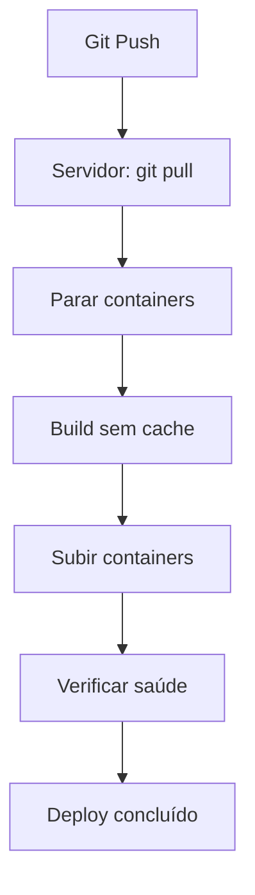

# 🚀 Guia de Deploy Automático - Hetzner + Docker

## 📋 Processo de Deploy Automatizado

Este documento registra o processo completo de deploy para que possa ser executado automaticamente no futuro.

---

## 🔧 Configuração do Ambiente

### Servidor Hetzner
- **Sistema**: Ubuntu 22.04
- **Docker**: Versão 29.1.3
- **Docker Compose**: Versão v5.0.0 (comando: `docker compose`)
- **Diretório do Projeto**: `/root/kanban-buzz-95241`
- **Porta da Aplicação**: 3000 (mapeada para 80 no container)

### Estrutura do Projeto
```
/root/kanban-buzz-95241/
├── docker-compose.yml      # Configuração Docker Compose
├── Dockerfile              # Build da aplicação React/Vite
├── nginx.conf              # Configuração Nginx
├── package.json            # Dependências Node.js
└── src/                    # Código fonte React
```

---

## 🚀 Processo de Deploy Automático

### Script Principal: `scripts/deploy-automatico.sh`

**Localização**: `/root/kanban-buzz-95241/scripts/deploy-automatico.sh`

**O que faz**:
1. ✅ Verifica pré-requisitos (Docker, Docker Compose)
2. ✅ Atualiza código via `git pull` (se for repositório Git)
3. ✅ Para containers atuais
4. ✅ Faz build sem cache (`--no-cache`)
5. ✅ Sobe containers novamente
6. ✅ Verifica saúde da aplicação
7. ✅ Mostra logs e status

**Como executar**:
```bash
# No servidor Hetzner
cd /root/kanban-buzz-95241
chmod +x scripts/deploy-automatico.sh
./scripts/deploy-automatico.sh
```

---

## 📝 Comandos Manuais (Alternativa)

Se preferir fazer manualmente ou o script não funcionar:

```bash
# 1. Ir para o diretório do projeto
cd /root/kanban-buzz-95241

# 2. Atualizar código (se necessário)
git pull

# 3. Parar containers
docker compose down

# 4. Remover container antigo (se necessário)
docker stop kanban-buzz-app 2>/dev/null || true
docker rm kanban-buzz-app 2>/dev/null || true

# 5. Build sem cache (IMPORTANTE!)
docker compose build --no-cache

# 6. Subir containers
docker compose up -d

# 7. Verificar status
docker compose ps

# 8. Ver logs
docker compose logs -f app
```

---

## 🔍 Verificações Pós-Deploy

### 1. Verificar Container
```bash
docker ps | grep kanban-buzz-app
```

**Saída esperada**:
```
CONTAINER ID   IMAGE                   STATUS         PORTS
xxx   kanban-buzz-95241-app   Up X seconds   0.0.0.0:3000->80/tcp
```

### 2. Verificar Aplicação
```bash
curl -I http://localhost:3000
```

**Saída esperada**: `HTTP/1.1 200 OK`

### 3. Verificar Logs
```bash
docker compose logs --tail=50 app
```

**Verificar se não há erros críticos**

---

## 🐛 Troubleshooting

### Problema: Container não sobe
```bash
# Ver logs detalhados
docker compose logs app

# Verificar se porta está em uso
netstat -tulpn | grep 3000

# Verificar se imagem foi buildada
docker images | grep kanban-buzz
```

### Problema: Build falha
```bash
# Limpar cache do Docker
docker system prune -a

# Tentar build novamente
docker compose build --no-cache
```

### Problema: Código não atualiza
```bash
# Verificar se git pull foi executado
git log --oneline -5

# Verificar se arquivos foram modificados
ls -la src/components/crm/CRMLayout.tsx
```

### Problema: Aplicação não responde
```bash
# Verificar se container está rodando
docker ps

# Verificar logs em tempo real
docker compose logs -f app

# Reiniciar container
docker compose restart app
```

---

## 📦 Estrutura do Docker

### docker-compose.yml
```yaml
services:
  app:
    build:
      context: .
      dockerfile: Dockerfile
    container_name: kanban-buzz-app
    restart: unless-stopped
    ports:
      - "3000:80"
```

### Dockerfile
- **Stage 1**: Build da aplicação React/Vite com Node.js
- **Stage 2**: Servir com Nginx (imagem Alpine)

---

## 🔄 Fluxo Completo de Deploy



---

## ⚙️ Variáveis de Ambiente

**Arquivo**: `.env` (não versionado)

**Variáveis importantes**:
- `VITE_SUPABASE_URL`
- `VITE_SUPABASE_PUBLISHABLE_KEY`

**⚠️ IMPORTANTE**: O arquivo `.env` não deve ser commitado no Git.

---

## 🎯 Checklist de Deploy

Antes de fazer deploy, verificar:

- [ ] Código commitado e pushado
- [ ] Sem erros de lint (`npm run lint`)
- [ ] Build local funciona (`npm run build`)
- [ ] Variáveis de ambiente configuradas no servidor
- [ ] Backup do container atual (opcional)

Após deploy:

- [ ] Container está rodando (`docker ps`)
- [ ] Aplicação responde (`curl http://localhost:3000`)
- [ ] Logs não mostram erros críticos
- [ ] Testar funcionalidade no navegador
- [ ] Limpar cache do navegador

---

## 📞 Comandos Rápidos

### Deploy Rápido (sem rebuild completo)
```bash
cd /root/kanban-buzz-95241
git pull
docker compose up -d --build
```

### Rebuild Completo
```bash
cd /root/kanban-buzz-95241
./scripts/deploy-automatico.sh
```

### Ver Status
```bash
docker compose ps
docker compose logs --tail=20 app
```

### Parar Aplicação
```bash
docker compose down
```

### Reiniciar Aplicação
```bash
docker compose restart app
```

---

## 🔐 Permissões

O script precisa de permissões de execução:
```bash
chmod +x scripts/deploy-automatico.sh
```

---

## 📝 Notas Importantes

1. **Sempre usar `--no-cache`** no build para garantir que todas as mudanças sejam aplicadas
2. **Aguardar 10-15 segundos** após subir o container antes de verificar
3. **Limpar cache do navegador** após cada deploy para ver mudanças
4. **Verificar logs** se algo não funcionar
5. **Docker Compose v5** usa `docker compose` (sem hífen), versão antiga usa `docker-compose`

---

## 🎉 Pronto!

Agora você tem um processo automatizado de deploy. Sempre que precisar fazer deploy:

```bash
./scripts/deploy-automatico.sh
```

Ou use os comandos manuais acima.


